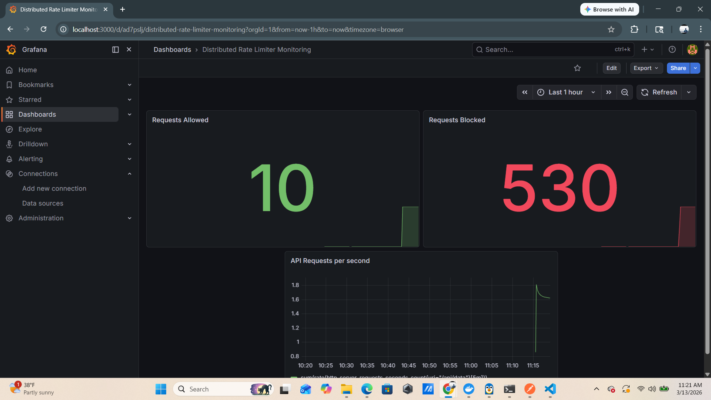

# Distributed Sliding Window Rate Limiter API

A production-style **distributed rate limiting service** built using **Spring Boot, Redis, Docker, Prometheus, and Grafana**.

The service protects APIs from abuse by limiting the number of requests a user can make within a **sliding time window**.

This project demonstrates **backend system design, distributed caching, observability, and containerized deployment** similar to real-world API infrastructure used in large-scale systems.

---

# Architecture


### Architecture Flow

1. Client sends request to API
2. API extracts `X-User-Id` header
3. RateLimiterService processes the request
4. Redis Sorted Set stores request timestamps
5. Requests outside the sliding window are removed
6. Redis counts remaining requests in the window
7. If request count exceeds limit → request blocked
8. Prometheus scrapes application metrics
9. Grafana visualizes system performance and traffic

---

# Features

- Distributed rate limiting using Redis
- Sliding window rate limiting algorithm
- Per-user and per-endpoint request limits
- Redis Sorted Set based request tracking
- Docker containerized deployment
- Prometheus metrics integration
- Grafana monitoring dashboards
- Production-style backend architecture

---

# Tech Stack

| Component | Technology |
|----------|-----------|
| Backend | Spring Boot |
| Cache | Redis |
| Rate Limiting | Redis Sorted Sets |
| Build Tool | Maven |
| Containerization | Docker |
| Monitoring | Prometheus |
| Visualization | Grafana |
| Metrics | Micrometer |

---

# Project Structure

```
ratelimiter
│
├── src/main/java/com/rahul/ratelimiter
│   ├── controller
│   │   └── RateLimitController.java
│   │
│   ├── service
│   │   └── RateLimiterService.java
│   │
│   ├── model
│   │   └── RateLimitProperties.java
│   │
│   └── RatelimiterApplication.java
│
├── src/main/resources
│   └── application.properties
│
├── docs
│   ├── architecture.png
│   └── grafana-dashboard.png
│
├── monitoring
│   ├── prometheus.yml
│   └── grafana-dashboard.json
│
├── docker-compose.yml
├── Dockerfile
├── pom.xml
└── README.md
```

---

# Rate Limiting Configuration

Example configuration in `application.properties`:

```
ratelimiter.windowSeconds=60

ratelimiter.limits.data=10
ratelimiter.limits.login=5
ratelimiter.limits.admin=2
```

| Endpoint | Limit | Window |
|---------|------|--------|
| /api/data | 10 requests | 60 seconds |
| /api/login | 5 requests | 60 seconds |
| /api/admin | 2 requests | 60 seconds |

---

# Sliding Window Rate Limiting

This project uses a **Sliding Window Algorithm** implemented using **Redis Sorted Sets**.

For every request:

1. Request timestamp is added to a Redis Sorted Set
2. Entries outside the time window are removed
3. Remaining entries are counted
4. If count exceeds limit → request rejected

### Redis Key Example

```
rate_limit:user123:/api/data
```

### Stored Data

```
timestamp → requestId
```

This ensures that only requests within the **last N seconds** are counted.

---

# Running the Application

### Clone the Repository

```
git clone https://github.com/rahulreddyin/distributed-rate-limiter-api.git
cd distributed-rate-limiter-api
```

---

# Start Infrastructure (Redis, Prometheus, Grafana)

```
docker compose up -d
```

Verify containers:

```
docker ps
```

Expected services:

| Service | Port |
|------|------|
| Spring Boot API | 8080 |
| Redis | 6379 |
| Prometheus | 9090 |
| Grafana | 3000 |

---

# Start Spring Boot Application

For local development:

```
./mvnw spring-boot:run
```

Application URL:

```
http://localhost:8080
```

---

# API Usage

All requests must include:

```
Header: X-User-Id
```

---

# Example Request

```
GET /api/data
```

Request:

```
GET http://localhost:8080/api/data
Header: X-User-Id: user123
```

Response:

```json
{
  "message": "Request allowed",
  "endpoint": "/api/data"
}
```

---

# Rate Limit Exceeded Example

```json
{
  "error": "Too Many Requests",
  "message": "Rate limit exceeded"
}
```

HTTP status:

```
429 Too Many Requests
```

---

# Observability

Spring Boot exposes **Prometheus metrics** through Actuator.

Metrics endpoint:

```
http://localhost:8080/actuator/prometheus
```

Prometheus collects:

- JVM metrics
- HTTP request metrics
- Redis command metrics
- Custom rate limiter metrics

---

# Grafana Monitoring Dashboard

Grafana visualizes system performance and API traffic.

Example dashboard:

<p align="center">

</p>

---

# Key Metrics

Allowed requests

```
ratelimiter_requests_allowed_total
```

Blocked requests

```
ratelimiter_requests_blocked_total
```

API request throughput

```
sum(rate(http_server_requests_seconds_count{uri="/api/data"}[5m]))
```

---

# Prometheus Queries

Allowed requests

```
ratelimiter_requests_allowed_total
```

Blocked requests

```
ratelimiter_requests_blocked_total
```

Request rate

```
sum(rate(http_server_requests_seconds_count{uri="/api/data"}[5m]))
```

---

# Access Monitoring Tools

Prometheus UI

```
http://localhost:9090
```

Grafana Dashboard

```
http://localhost:3000
```

Login:

```
Username: admin
Password: admin
```

---

# Docker Deployment

Run the full stack:

```
docker compose up --build
```

Services started:

| Service | Port |
|------|------|
| Spring Boot API | 8080 |
| Redis | 6379 |
| Prometheus | 9090 |
| Grafana | 3000 |

---

# Example Rate Limiter Workflow

Client request

```
GET /api/admin
Header: X-User-Id: admin123
```

Redis key generated

```
rate_limit:admin123:/api/admin
```

Redis stores timestamp in Sorted Set.

Old entries are removed automatically to maintain the sliding window.

---

# System Design Concepts Demonstrated

This project demonstrates:

- distributed rate limiting
- sliding window algorithms
- Redis Sorted Set based request tracking
- API request throttling
- observability using Prometheus
- monitoring dashboards with Grafana
- containerized backend services
- scalable backend architecture

---

# Future Improvements

Potential enhancements:

- token bucket algorithm
- Redis Lua script atomic rate limiting
- API gateway integration
- Kubernetes deployment
- multi-node load testing

---

# Author

Rahul Reddy

GitHub

```
https://github.com/rahulreddyin
```

---