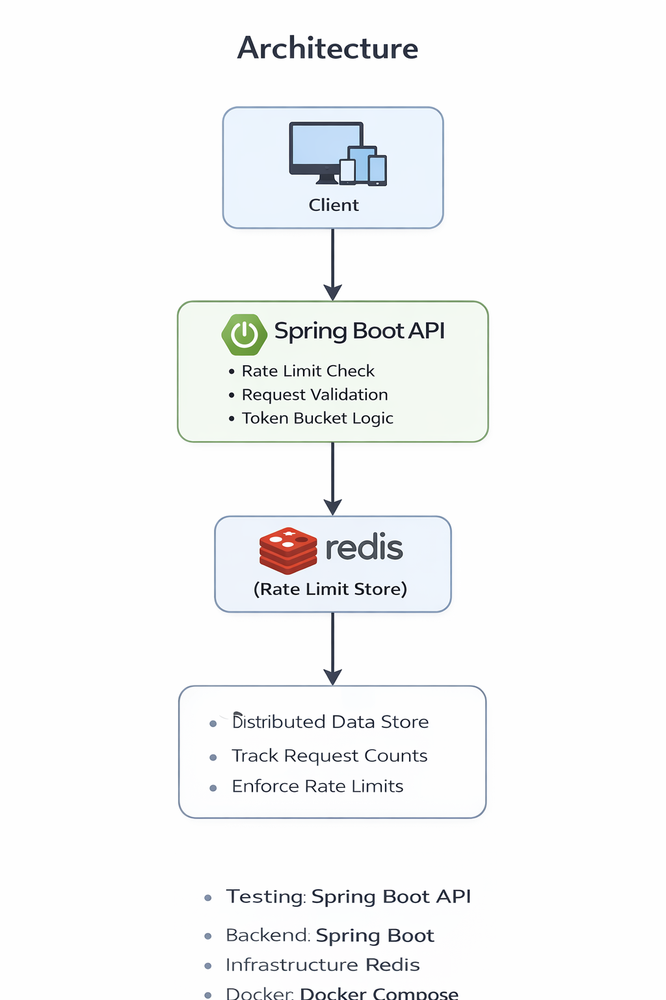

# Distributed Rate Limiter API

A production-style **distributed rate limiting service** built using **Spring Boot, Redis, Docker, and Prometheus**.

The service protects APIs from abuse by limiting the number of requests a user can make within a configured time window.

This project demonstrates **backend system design, distributed caching, observability, and containerized deployment**.

---

# Architecture



### Architecture Flow

1. Client sends a request to the API
2. API extracts the `X-User-Id` header
3. RateLimiterService checks Redis for the request counter
4. Redis stores counters with TTL expiration
5. If request exceeds limit → request blocked
6. Prometheus collects metrics for monitoring

---

# Features

- Distributed rate limiting using Redis
- Per-user and per-endpoint request limits
- Time-window throttling
- Dockerized environment
- Prometheus metrics
- Production-style backend architecture

---

# Tech Stack

| Component | Technology |
|----------|-----------|
| Backend | Spring Boot |
| Cache | Redis |
| Build Tool | Maven |
| Containerization | Docker |
| Monitoring | Prometheus |
| Metrics | Micrometer |

---

# Project Structure

```
ratelimiter
│
├── src/main/java/com/rahul/ratelimiter
│   ├── controller
│   │   └── RateLimitController.java
│   │
│   ├── service
│   │   └── RateLimiterService.java
│   │
│   ├── model
│   │   └── RateLimitProperties.java
│   │
│   └── RatelimiterApplication.java
│
├── src/main/resources
│   └── application.properties
│
├── docs
│   └── architecture.png
│
├── docker-compose.yml
├── Dockerfile
├── pom.xml
└── README.md
```

---

# Rate Limiting Configuration

Example configuration inside `application.properties`:

```
ratelimiter.windowSeconds=60

ratelimiter.limits.data=10
ratelimiter.limits.login=5
ratelimiter.limits.admin=2
```

| Endpoint | Limit | Window |
|---------|------|--------|
| /api/data | 10 requests | 60 seconds |
| /api/login | 5 requests | 60 seconds |
| /api/admin | 2 requests | 60 seconds |

---

# Running the Application

### Clone Repository

```
git clone https://github.com/rahulreddyin/distributed-rate-limiter-api.git
cd distributed-rate-limiter-api
```

---

# Start Redis

```
docker compose up -d redis
```

Verify Redis container:

```
docker ps
```

Expected output:

```
CONTAINER ID   IMAGE   PORTS
redis          redis   6379->6379
```

---

# Start Spring Boot Application

```
./mvnw spring-boot:run
```

Application runs on

```
http://localhost:8080
```

---

# API Usage

All requests must include header

```
X-User-Id
```

---

# Example Request

### Endpoint

```
GET /api/data
```

### Request

```
GET http://localhost:8080/api/data
X-User-Id: user123
```

### Response

```json
{
  "message": "Request allowed",
  "endpoint": "/api/data"
}
```

---

# Example Admin Endpoint

```
GET http://localhost:8080/api/admin
X-User-Id: admin123
```

### Request 1

```json
{
  "message": "Request allowed",
  "endpoint": "/api/admin"
}
```

### Request 2

```json
{
  "message": "Request allowed",
  "endpoint": "/api/admin"
}
```

---

# Rate Limit Exceeded Example

Third request within window:

```json
{
  "error": "Too Many Requests",
  "message": "Rate limit exceeded"
}
```

HTTP Status

```
429 Too Many Requests
```

---

# Postman Testing Example

Send multiple requests quickly:

```
GET /api/admin
X-User-Id: admin123
```

Expected results

| Request | Result |
|-------|-------|
| 1 | Allowed |
| 2 | Allowed |
| 3 | Blocked |

---

# Observability

The service exposes **Prometheus-compatible metrics**.

Metrics endpoint

```
http://localhost:8080/actuator/prometheus
```

---

# Custom Metrics

| Metric | Description |
|------|-------------|
| ratelimiter_requests_allowed_total | Total allowed requests |
| ratelimiter_requests_blocked_total | Total blocked requests |

Example output

```
ratelimiter_requests_allowed_total 4
ratelimiter_requests_blocked_total 1
```

---

# Additional Metrics

Prometheus automatically exposes system metrics

```
jvm_memory_used_bytes
system_cpu_usage
http_server_requests_seconds
process_cpu_usage
```

These metrics help monitor

- JVM memory usage
- CPU utilization
- HTTP request performance
- service health

---

# Docker Deployment

Start full stack

```
docker compose up --build
```

Services started

| Service | Port |
|-------|------|
| Spring Boot API | 8080 |
| Redis | 6379 |

---

# Example Rate Limiter Workflow

Client request

```
GET /api/admin
X-User-Id: admin123
```

Redis key generated

```
rate_limit:admin123:/api/admin
```

Redis increments counter

If limit exceeded → request blocked.

---

# System Design Concepts Demonstrated

This project demonstrates

- Distributed rate limiting
- Redis-based caching
- Time window request throttling
- Observability using Prometheus
- Containerized backend services
- scalable backend architecture

---

# Future Improvements

Possible enhancements

- Grafana dashboards
- token bucket algorithm
- sliding window log limiter
- Kubernetes deployment
- API gateway integration

---

# Author

Rahul Reddy

GitHub

```
https://github.com/rahulreddyin
```

---
